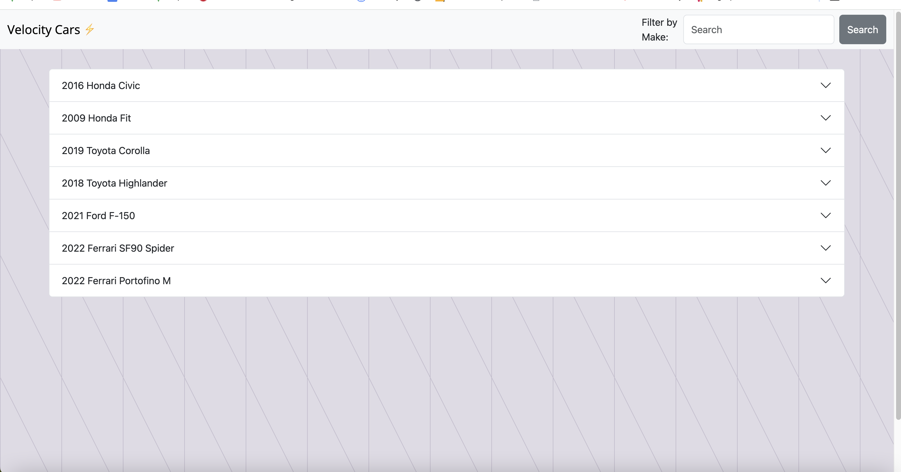
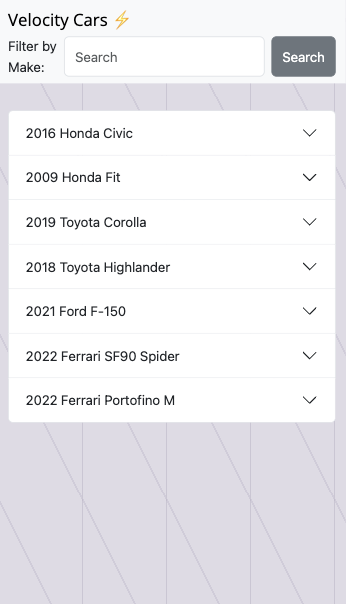

# car-catalog

## Description
This application was designed to enable prospective car buyers to explore the assortment of vehicles offered by an online car dealership.

## Usage
Open the link in the browser to view a list of the available cars. Open the console when making 'Search' requests to view a list of the searched car make. 

Website View:

Mobile View:

## Links
https://lilym036.github.io/car-catalog/

## Credits

Technologies Used: 
<ul>
<li>HTML</li>
<li>CSS</li>
<li>JavaScript</li>
<li>Bootstrap</li>
<li>Razoyo API</li>
</uL>

